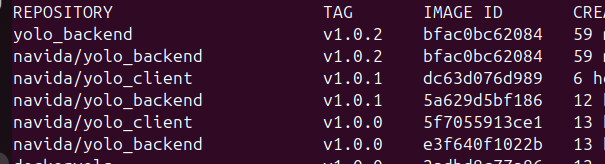

## Choice of the Kubernetes Objects used for deployment (Use of - or the lack of use - of StatefulSets for storage solutions).
The frontend and backend make use of Deployment objects
The database makes use of StatefulSet objects for persistent storage

## Method used to expose your pods to internet traffic.
The frontend is exposed externally through use of the LoadBalancer service type

## Git workflow used to achieve the task.
Add the backend deployment file
`git add backend-deployment.yaml`
`git commit -m "Add backend deployment file"`

Add the backend service file
`git add backend-service.yaml`
`git commit -m "Add backend service file"`

Add the frontend deployment file
`git add frontend-deployment.yaml`
`git commit -m "Add frontend deployment file"`

Add the frontend service file
`git add frontend-service.yaml`
`git commit -m "Add frontend service file"`

Add the database service file
`git add database-service.yaml`
`git commit -m "Add database service file"`

Add the database statefulset file
`git add database-deployment.yaml`
`git commit -m "Add database deployment file"`

Push commits to github
`git push`

## Successful running of the applications from the link provided in your github Repositorys README.md, if not the debugging measures applied.
The application can be run by following the steps in the README file

## Good practices such as Docker image tag naming standards for ease of identification and personalization of images and containers.
